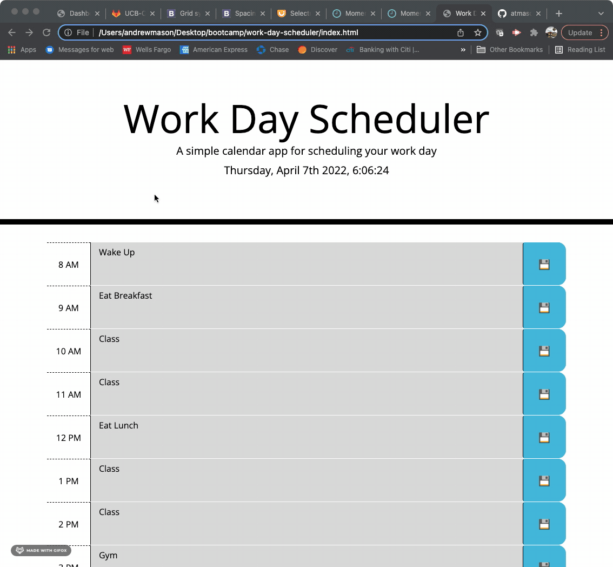

# Work Day Scheduluer


## Purpose of This Project

The purpose of this project was to create an organized work day scheduler to pre-plan tasks throughout the work day. This application utilizes HTML, CSS, JavaScript, Bootstrap, Moment JS, and JQuery technologies.

The application allows the user to input text into each hour time-block and save that task to their local storage in the browser using a save button. This functionality allows the user to refresh the page without losing any data they had previously entered.

Another key function of this page is automatic styling for each time-block based on the current time of day. Hours that occured in the past will appear with a gray background, the current hour will appear with a red background, and hours that occur in the future will appear with a green background. 

## Links

Link to GitHub Repository:
[GitHub Repository](https://github.com/atmason90/work-day-scheduler)

Link to Deployed Application:
[deployed application](https://atmason90.github.io/work-day-scheduler/)

## Application Demo

This demo displays the functionality of the application. As shown, the header of the page displays a constantly updated date and time. When the user enters a task into a time-block, clicks the save button, then refreshes the page, the entered data persists. 



## Code Examples

This is an example of how the time blocks were structured in HTML using bootstrap.

```html
<div id="8" class="row time-block">
            <div class="col-1 hour">
              8 AM
            </div>
            <textarea class="col-10 description">
            </textarea>
            <button class="btn saveBtn col-1"></button>
        </div>
```

This example shows how moment js was utilized to display the current time and how a setInterval function was used to constantly update the time on the page.

```js
$("#currentDay").text(moment().format("dddd, MMMM Do YYYY, h:mm:ss"));

var updateTime = setInterval(function () {
    var currentTime = moment().format("dddd, MMMM Do YYYY, h:mm:ss")
    $("#currentDay").text(currentTime)
}, 1000);
```

This example shows the function that was used to compare each time-block with the current time of day, and then style all timeblocks accordingly.

```js
function compareHour() {
    var hour = moment().hour();
    
    $(".time-block").each(function () {
        var block = $(this).attr("id");
        
        if (block < hour) {
            $(this).addClass("past");
            $(this).removeClass("present");
            $(this).removeClass("future");
        } else if (block == hour) {
            $(this).removeClass("past");
            $(this).addClass("present");
            $(this).removeClass("future");
        } else {
            $(this).removeClass("past");
            $(this).removeClass("present");
            $(this).addClass("future");
        }
    });
};
```

## Technologies Used


## License

MIT License

Copyright (c) 2022 Andrew Mason

Permission is hereby granted, free of charge, to any person obtaining a copy of this software and associated documentation files (the "Software"), to deal in the Software without restriction, including without limitation the rights to use, copy, modify, merge, publish, distribute, sublicense, and/or sell copies of the Software, and to permit persons to whom the Software is furnished to do so, subject to the following conditions:

The above copyright notice and this permission notice shall be included in all copies or substantial portions of the Software.

THE SOFTWARE IS PROVIDED "AS IS", WITHOUT WARRANTY OF ANY KIND, EXPRESS OR IMPLIED, INCLUDING BUT NOT LIMITED TO THE WARRANTIES OF MERCHANTABILITY, FITNESS FOR A PARTICULAR PURPOSE AND NONINFRINGEMENT. IN NO EVENT SHALL THE AUTHORS OR COPYRIGHT HOLDERS BE LIABLE FOR ANY CLAIM, DAMAGES OR OTHER LIABILITY, WHETHER IN AN ACTION OF CONTRACT, TORT OR OTHERWISE, ARISING FROM, OUT OF OR IN CONNECTION WITH THE SOFTWARE OR THE USE OR OTHER DEALINGS IN THE SOFTWARE.

